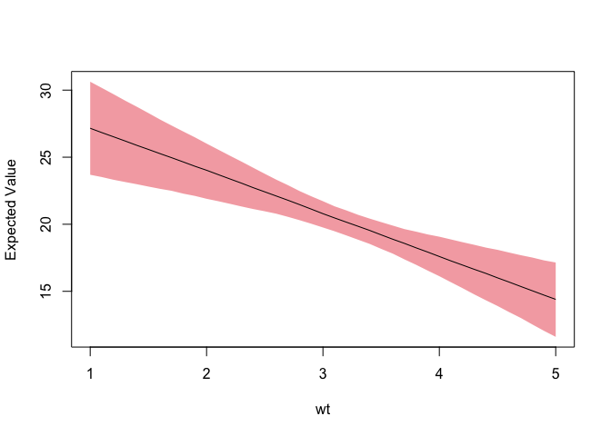

<!-- README.md is generated from README.Rmd. Please edit that file -->
regsim
======

[](https://travis-ci.org/altaf-ali/regsim)

An R Package for dealing with statistical uncertainty in regression models.

Installation
------------

You can install regsim from github with:

``` r
# install.packages("devtools")
devtools::install_github("altaf-ali/regsim")
```

Example
-------

``` r
library(regsim)

model <- lm(mpg ~ wt + cyl, data = mtcars)
x <- list(
  wt = seq(1, 5, 0.1), 
  cyl = mean(mtcars$cyl)
)

sim <- regsim(model, x)

plot(sim, ~ wt)
```


